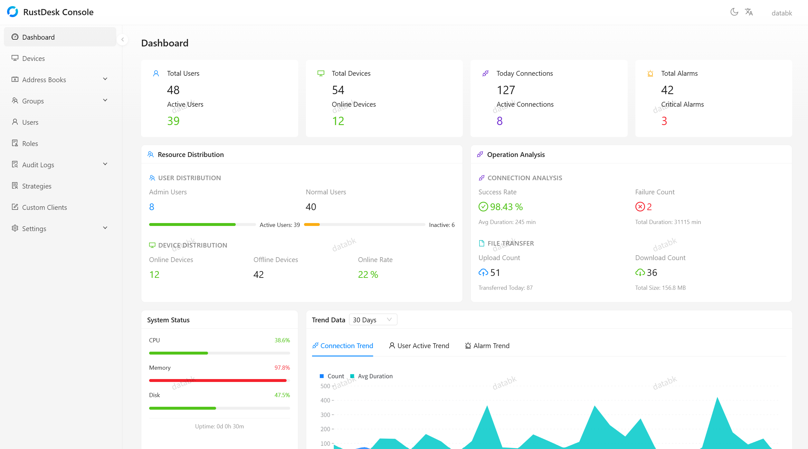
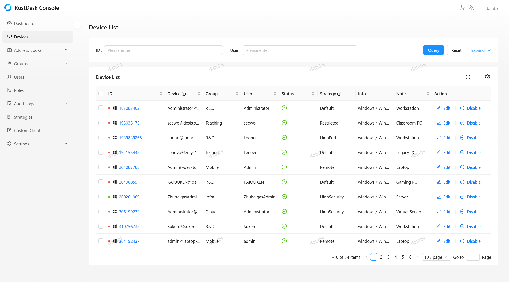

# RustDesk Console

<p align="center">
  <strong>Remote Desktop Management Console for RustDesk</strong>
</p>

<p align="center">
  <a href="https://discord.gg/vrQSJfqpwD">Discord Community</a> · <a href="https://github.com/databk/rustdesk-console-web">Frontend Project</a>
</p>

---

## 📖 Overview

**RustDesk Console** is a comprehensive management platform built with [NestJS](https://nestjs.com/) that powers the RustDesk remote desktop ecosystem. It provides robust device management, user authentication, address book management, strategy configuration, security auditing, and real-time monitoring capabilities for enterprise-grade remote desktop deployments.

This console serves as the central hub for managing RustDesk clients, handling everything from user authentication and authorization to device grouping, access control, strategy delivery, and comprehensive audit logging.

## 🖼️ Screenshots

### Dashboard

Overview statistics with real-time monitoring data, resource distribution, operation analysis, system status, and trend charts.

<p align="center">
  
</p>

### Device Management

Comprehensive device list with status tracking, strategy assignment, group management, and batch operations.

<p align="center">
  
</p>

### Address Book

Personal and shared address books with tag-based organization, device peer management, and access control.

<p align="center">
  
</p>

### File Transfer Audit

File transfer auditing with detailed logs showing direction, file size, timestamps, and export capabilities.

<p align="center">
  
</p>

## ✨ Key Features

### Authentication & Security
- **JWT-based Authentication**: Secure token-based authentication with automatic token refresh and revocation (JTI blacklist)
- **Two-Factor Authentication (2FA/TOTP)**: Enhanced security using TOTP via `otplib`, with admin-enforced 2FA policies
- **Email Verification**: Email-based verification system using Nodemailer with Handlebars templates
- **OIDC Integration**: Support for OpenID Connect providers (e.g., Google, GitHub) with Authorization Code Flow + PKCE, including web frontend login support
- **Password Encryption**: Secure password hashing using `bcryptjs`
- **Rate Limiting**: Built-in request throttling to prevent abuse (100 req/min default, 5 req/min for login)

### User Management
- Complete CRUD operations for user accounts (RESTful conventions)
- User invitation via email
- Enable/disable user accounts with batch operations
- Force logout capabilities (single and batch)
- Admin role-based access control with dedicated admin user queries
- TFA enforcement policies
- User avatar upload and management (auto-converted to WebP, 256x256)
- Change password for current user
- Batch security settings management (TFA enforcement, email verification)

### Address Book Management
- Personal and shared address books
- Device peer management (add, update, delete)
- Tag-based organization with custom colors
- Access rules and permission levels
- Legacy API compatibility support
- Pagination and search functionality

### Device Group Management
- Create and manage device groups
- Assign devices to groups with role-based permissions
- User-to-user permission mapping
- Device enable/disable controls
- Accessible resource queries based on user permissions
- Batch device status updates
- Force disconnect device connections

### Strategy Management
- Create and manage configuration strategies
- Assign strategies to devices, users, or device groups
- Strategy lookup priority: device > user > device group
- Batch assign/unassign operations (up to 200 targets)
- Strategy delivery via heartbeat response

### Dashboard & Analytics
- Overview statistics (users, devices, connections, alarms)
- Trend analysis with configurable time ranges (7d/30d/90d)
- Real-time monitoring data
- Multi-metric support (connection, user, device, alarm)

### Audit & Compliance
- **Connection Auditing**: Track all remote connections (established, closed, authorized) with connection type classification
- **File Transfer Auditing**: Monitor file send/receive operations with file details and advanced filters
- **Security Alarm Auditing**: Log security events (IP whitelist violations, brute force attempts, etc.)
- **Console Auditing**: Track management console operations
- Connection audit note management
- Comprehensive timestamp tracking (requested, established, closed times)

### Real-time Monitoring
- **Heartbeat System**: Monitor device online status and last activity
- **Active Connection Tracking**: Track currently active remote connections
- **System Information Collection**: Gather hardware/OS details from connected devices
- Automatic status updates and device tracking
- Force disconnect via heartbeat response

### Email Services
- Welcome email templates
- Verification code emails
- Customizable Handlebars templates
- SMTP configuration management API with test endpoint
- Dynamic SMTP settings via system settings API

### System Settings
- Generic key-value settings storage
- SMTP configuration management (CRUD with password masking)
- SMTP connection testing

## 🛠️ Tech Stack

| Category | Technology |
|----------|------------|
| **Framework** | NestJS 11 (TypeScript) |
| **Database** | SQLite via TypeORM 0.3 |
| **Authentication** | JWT (passport-jwt), Passport.js |
| **Security** | bcryptjs, otplib (TOTP), @nestjs/throttler |
| **Email** | Nodemailer + Handlebars templates |
| **Image Processing** | sharp (avatar conversion to WebP) |
| **OIDC** | openid-client (Authorization Code Flow + PKCE) |
| **Validation** | class-validator, class-transformer |
| **Utilities** | uuid, dotenv, cookie-parser |
| **Testing** | Jest, supertest |

## 🚀 Quick Start

### Prerequisites

- **Node.js** >= 18.0.0
- **npm** >= 9.0.0
- **SQLite3** (included as dependency)

### Installation

RustDesk Console provides multiple installation methods to suit different deployment needs.

> **Default Admin Credentials**: username `databk`, password `databk`. Please change the default password before deploying to production!

#### 🔧 Option 1: Build from Source (Recommended for Development)

Clone the repository and build from source:

```bash
# Clone the repository
git clone https://github.com/databk/rustdesk-console.git
cd rustdesk-console

# Install dependencies
npm install

# Copy environment configuration
cp .env.example .env

# Edit .env with your configuration (see Environment Variables section)
nano .env
```

#### 🐳 Option 2: Docker Deployment (Recommended for Production)

This project uses a **frontend-backend separated architecture**. The backend (this project) serves the API, and the [frontend project](https://github.com/databk/rustdesk-console-web) provides the web UI. In production, only port **21114** needs to be exposed externally; the backend's port 3000 is only accessed internally by the frontend and does not need to be exposed.

**Docker Compose** (recommended):

The project includes a [`docker-compose.yml`](docker-compose.yml) file for easy deployment.

```bash
docker compose up -d
```

> **Note**: The frontend container connects to the backend via the internal Docker network using the service name `rustdesk-console:3000`. No additional network configuration is needed with the default setup.

**Using GitHub Container Registry (ghcr)**:

If you prefer GHCR images, modify the image lines in [`docker-compose.yml`](docker-compose.yml):

```yaml
    image: ghcr.io/databk/rustdesk-console:latest      # backend
    image: ghcr.io/databk/rustdesk-console-web:latest   # frontend
```

**Docker CLI** (alternative, without Compose):

```bash
# Create a shared network
docker network create rustdesk-net

# Start the backend
docker run -d \
  --name rustdesk-console \
  --network rustdesk-net \
  -e JWT_SECRET=your-super-secret-key \
  -v ./data:/data \
  databk/rustdesk-console:latest

# Start the frontend
docker run -d \
  --name rustdesk-console-web \
  --network rustdesk-net \
  -p 21114:80 \
  -e BACKEND_URL=http://rustdesk-console:3000 \
  databk/rustdesk-console-web:latest
```

Available image tags (Docker Hub & GHCR):
- `latest` - Latest stable release
- `X.Y.Z` - Specific version (e.g., `1.3.0`)

### Running the Application

```bash
# Development mode (with hot reload)
npm run start:dev

# Standard development mode
npm run start

# Production mode
npm run build
npm run start:prod

# Debug mode
npm run start:debug
```

The API will be available at `http://localhost:3000/api` (configurable via `PORT` env var).

## 📁 Project Structure

```
src/
├── main.ts                    # Application entry point
├── app.module.ts              # Root application module
│
├── modules/
│   ├── auth/                  # Authentication & authorization (JWT, TFA, OIDC, email)
│   ├── user/                  # User management (CRUD, avatar, password, admin queries)
│   ├── address-book/          # Address book & device peer management
│   ├── device-group/          # Device grouping & permissions
│   ├── strategy/              # Strategy configuration & assignment
│   ├── audit/                 # Connection/file/alarm/console audit logging
│   ├── heartbeat/             # Device heartbeat monitoring & active connections
│   ├── sysinfo/               # System information collection
│   ├── oidc/                  # OpenID Connect integration (client & web login)
│   ├── dashboard/             # Dashboard statistics & analytics
│   ├── settings/              # System settings (SMTP configuration)
│   └── email/                 # Email services (templates, SMTP)
│
├── common/                    # Shared utilities (guards, decorators, entities)
└── database/                  # Database initialization & seed data
```

## ⚙️ Environment Configuration

Copy `.env.example` to `.env` and configure the variables.

> ⚠️ **Security Note**: Always change default passwords and JWT secrets before deploying to production!

## 🗄️ Database

The application uses **SQLite** as the default database engine (file: `rustdesk-console.db` in project root, or `/data/rustdesk-console.db` in Docker), managed by **TypeORM 0.3**.

**Core Data Models Include:**
- User accounts, tokens & avatars
- Address books, peers, tags & access rules
- Device groups & permissions
- Strategies & assignments
- Audit logs (connections, file transfers, alarms, console)
- Active connections
- Device system information & heartbeats
- OIDC provider configurations & auth states
- Email verification sessions
- System settings

> **Configuration**: Database settings can be modified in [`src/app.module.ts`](src/app.module.ts). The application supports migration to PostgreSQL or MySQL for production deployments requiring higher concurrency.

## 🛡️ Security Features

### Authentication Flow
1. User submits credentials to `POST /api/login`
2. Server validates credentials (with optional TFA check)
3. Returns JWT access token + refresh token
4. Client includes Bearer token in Authorization header for subsequent requests
5. Token is validated on each request via `JwtAuthGuard`
6. Token can be revoked via `POST /api/logout` (JTI blacklist)

### 2FA Flow
1. User calls `POST /api/2fa/setup` to generate TOTP secret and QR code URL
2. User verifies with `POST /api/2fa/verify` to bind the 2FA secret
3. On login, if 2FA is enabled, server returns `tfa_check` response
4. Client submits TFA code to complete login
5. Admins can enforce 2FA for users; enforced users cannot disable 2FA themselves

### Rate Limiting Strategy
- **Global**: 100 requests per minute per IP
- **Login endpoint**: 5 attempts per minute (brute force protection)
- **Heartbeat submissions**: 10 per minute per device
- **System info submissions**: 5 per minute per device
- **Audit recording**: 50 per minute
- **Avatar access**: 60 per minute
- **OIDC auth query**: 120 per minute

### Security Layers
- **JwtAuthGuard**: Global JWT authentication (bypassed via `@Public()` decorator)
- **AdminGuard**: Restricts sensitive endpoints to admin users only
- **ThrottlerGuard**: Global rate limiting protection
- **DeviceThrottlerGuard**: Specialized rate limiting for device endpoints
- **ValidationPipe**: Global input validation with auto-whitelisting and transformation
- **CORS**: Configured to allow all origins (restrict in production)

## 🧪 Development

### Available Scripts

```bash
# Development
npm run start:dev      # Start with hot-reload (watch mode)
npm run start:debug    # Start with debug mode

# Building
npm run build          # Compile TypeScript to JavaScript

# Code Quality
npm run lint           # Lint code with ESLint
npm run format         # Format code with Prettier

# Testing
npm run test           # Run unit tests
npm run test:watch     # Run tests in watch mode
npm run test:cov       # Run tests with coverage report
npm run test:e2e       # Run end-to-end tests
npm run test:debug     # Run tests in debug mode
```

### Code Style
- **Language**: TypeScript with strict typing
- **Linting**: ESLint with Prettier integration
- **Naming Conventions**:
  - Files: kebab-case (`auth.service.ts`)
  - Classes: PascalCase (`AuthService`)
  - Methods/Variables: camelCase (`getUserById`)
- **Documentation**: JSDoc comments on public methods
- **Commit Messages**: Follow [Conventional Commits](https://www.conventionalcommits.org/)

## 🐳 Deployment Considerations

### Production Checklist
- [ ] Change `JWT_SECRET` to a strong random value (min 32 chars)
- [ ] Change default admin password (default: `databk`) in `.env`
- [ ] Configure production SMTP settings via the Settings API
- [ ] Set `synchronize: false` in TypeORM config and use migrations
- [ ] Configure CORS origins to your frontend domain only
- [ ] Set up HTTPS/reverse proxy (nginx, Apache, etc.)
- [ ] Configure backup strategy for SQLite database
- [ ] Set up process manager (PM2, systemd) for auto-restart
- [ ] Review and adjust rate limiting for your traffic patterns
- [ ] Enable proper logging (currently disabled: `logging: false`)
- [ ] Configure `WEB_FRONTEND_URLS` for OIDC web login

### Scaling Notes
- **SQLite Limitations**: Single-writer, suitable for small-medium deployments (< 100 concurrent users)
- **For High Availability**: Migrate to PostgreSQL with connection pooling
- **Horizontal Scaling**: Consider Redis for session/token storage if running multiple instances
- **Performance**: Enable WAL mode for better SQLite read concurrency

## 🤝 Contributing

1. Fork the repository
2. Create a feature branch (`git checkout -b feature/amazing-feature`)
3. Commit your changes (`git commit -m 'feat: add amazing feature'`)
4. Push to the branch (`git push origin feature/amazing-feature`)
5. Open a Pull Request

**Commit Message Format**: Follow [Conventional Commits](https://www.conventionalcommits.org/)
- `feat:` New feature
- `fix:` Bug fix
- `docs:` Documentation changes
- `style:` Code style changes (formatting, etc.)
- `refactor:` Code refactoring
- `test:` Adding/updating tests
- `chore:` Maintenance tasks

## 📄 License

This project is licensed under the **GNU Affero General Public License v3.0** (AGPL-3.0) - see [LICENSE](LICENSE) file for details.

## 📚 Additional Resources

- [Discord Community](https://discord.gg/vrQSJfqpwD) - Join our community for discussions and support
- [Frontend Project](https://github.com/databk/rustdesk-console-web) - Web UI for RustDesk Console
- [NestJS Documentation](https://docs.nestjs.com/) - Framework documentation
- [TypeORM Documentation](https://typeorm.io/) - ORM documentation
- [RustDesk Official Site](https://rustdesk.com/) - Main product information
- [Passport.js Documentation](http://www.passportjs.org/) - Authentication middleware

---

<p align="center">
  <strong>Built with ❤️ using NestJS | The RustDesk Console Backend</strong>
</p>
